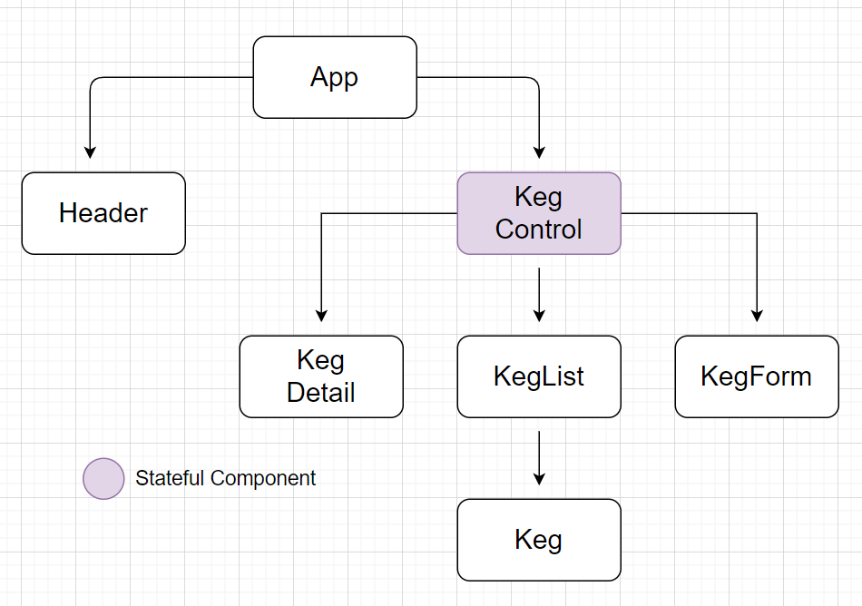

# ⚛️🍺 _Tawnee's Tap House 2.0_

#### _React with Redux Solo Project for Epicodus_
#### _DATE 02.19.2021_

#### ✒️ By _**Tawnee Harris**_

## 📋 Description

This application will allow a user to keep track of the kegs in their tap house using React and Redux. New kegs can be added with the number of pints left tracked. Keg details will also be available.

## ⚙️ Setup/Installation Requirements 

Software Requirements
* An internet browser of your choice; I prefer Chrome
* A code editor; I prefer VSCode

Open by Downloading or Cloning
* Navigate to <https://github.com/tawneeh/tawnees-tap-house-2.git>
* Download this repository to your computer by clicking the green Code button and 'Download Zip'
* Or clone the repository

Setup Instructions 
* After the repository is on your computer, navigate to the terminal and type in `npm install`
* Next, `npm start`
* View the page in the live server that opens

## ✔️ Jest Testing

Actions and reducers have been tested. To run the tests, type `npm test` into the terminal. If `No tests found` is stated in the terminal, please press `a` to run all tests.

* Test Suites: 4
* Tests: 13
* All tests passing

## 🌳 React Component Tree

## 🐜 Known Bugs

This application does not save the new Pint quantity to the Master Keg List. 

## ☎️ Support and Contact Details

Please feel free to reach out to me anytime at <tawneeh@icloud.com>

## 💾 Technologies Used

* React
* Redux
* JavaScript
* JSX
* Jest Testing
* Webpack
* Babel
* Eslint
* Created using `create-react-app`

### License

Copyright (c) 2021 **_Tawnee Harris_** ⚖️